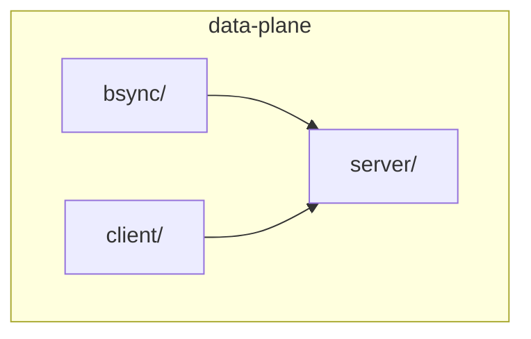
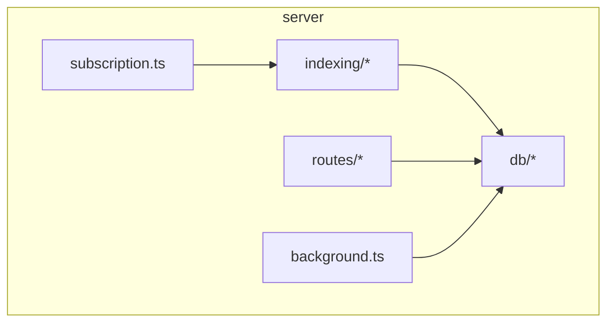
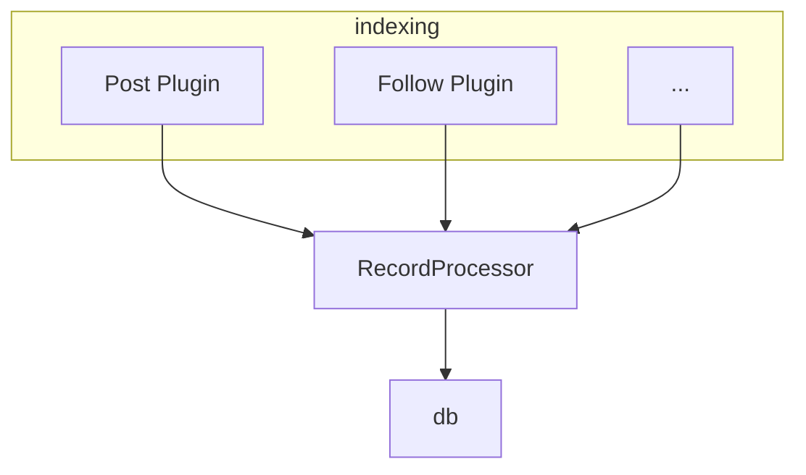
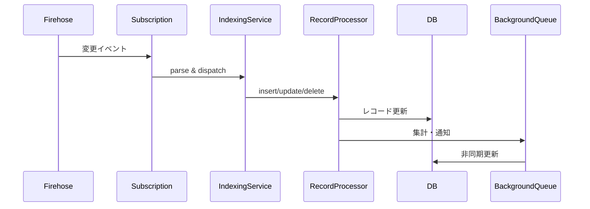

# Data Plane 概要

本ドキュメントでは `packages/bsky/src/data-plane` ディレクトリの役割と主要コンポーネントについて説明します。Bluesky アプリケーションが参照するデータのインデックス処理や API 提供を担うサブモジュール群です。

## ディレクトリ構成

```text
packages/bsky/src/data-plane/
├── bsync          # テスト用の Mock Bsync サーバ
├── client         # データプレーンクライアント実装
├── server         # データプレーンのサーバ実装
└── index.ts       # 上位からの再エクスポート
```



## クライアント(`client`)

- `createDataPlaneClient()` で複数ホストに分散したデータプレーン API をラウンドロビンで呼び出すクライアントを作成します【F:packages/bsky/src/data-plane/client/index.ts†L18-L52】。
- `HostList` により接続先ホストのリストを動的に更新でき、`EtcdHostList` は etcd からホスト情報を取得します【F:packages/bsky/src/data-plane/client/hosts.ts†L1-L69】【F:packages/bsky/src/data-plane/client/hosts.ts†L70-L128】。
- データプレーン API のエラー判定や DID ドキュメントのサービス情報展開などのユーティリティを `util.ts` にまとめています【F:packages/bsky/src/data-plane/client/util.ts†L1-L61】【F:packages/bsky/src/data-plane/client/util.ts†L62-L104】。

## サーバ(`server`)

データプレーンの本体。Express + Connect RPC を用いて以下の機能を提供します。

### 構成図


### 主要モジュール

- **Database**: Kysely を用いた PostgreSQL アクセス層【F:packages/bsky/src/data-plane/server/db/db.ts†L1-L164】。
- **RepoSubscription**: Firehose 経由でリポジトリ更新を購読し `IndexingService` に伝える役割【F:packages/bsky/src/data-plane/server/subscription.ts†L1-L99】。
- **IndexingService**: 各レコード種別のプラグインを束ね、データベースへインデックスします【F:packages/bsky/src/data-plane/server/indexing/index.ts†L1-L83】【F:packages/bsky/src/data-plane/server/indexing/index.ts†L84-L173】。
- **RecordProcessor**: 各プラグイン共通の挿入・削除ロジックや通知生成を実装するクラス【F:packages/bsky/src/data-plane/server/indexing/processor.ts†L1-L69】【F:packages/bsky/src/data-plane/server/indexing/processor.ts†L70-L150】。
- **Routes**: `routes/` 以下に API ごとの実装が分割されており、`createRoutes` でまとめて Connect サービスとして公開します【F:packages/bsky/src/data-plane/server/routes/index.ts†L1-L33】。
- **BackgroundQueue**: 非同期処理をシンプルなキューで実行【F:packages/bsky/src/data-plane/server/background.ts†L1-L32】。

#### プラグイン構造

`indexing/plugins/` にはポストやフォローなど各レコードに対応したプラグインがあり、`RecordProcessor` を利用してインデックス処理と通知生成を行います。



### 処理フロー
1. `RepoSubscription` が Firehose からイベントを受信し、`IndexingService` に渡す。
2. `IndexingService` は該当コレクションのプラグインを選択し、`RecordProcessor` 経由でデータベースへ書き込み。
3. 必要に応じて `BackgroundQueue` で非同期集計や通知作成を実行。
4. `routes/` の各 RPC からデータを取得し、`DataPlaneClient` から利用される。



## Bsync

- `MockBsync` はテスト向けのモック実装で、ミュートやプライベートデータ操作を行う簡易 RPC サーバです【F:packages/bsky/src/data-plane/bsync/index.ts†L1-L82】【F:packages/bsky/src/data-plane/bsync/index.ts†L160-L233】。

## 依存関係

- DB 操作: `kysely`, `pg`
- RPC: `@connectrpc/connect`, `express`
- ID 解決: `@atproto/identity`
- Firehose 連携: `@atproto/sync`

## まとめ

`data-plane` ディレクトリは、Bluesky アプリケーションにおけるデータの集約と提供を担う重要な層です。RepoSubscription で取得したイベントをインデックスし、DB に保持された情報を Connect RPC 経由でクライアントへ返します。クライアント側は複数ホスト対応の `DataPlaneClient` を通じてこれらの API を利用します。

