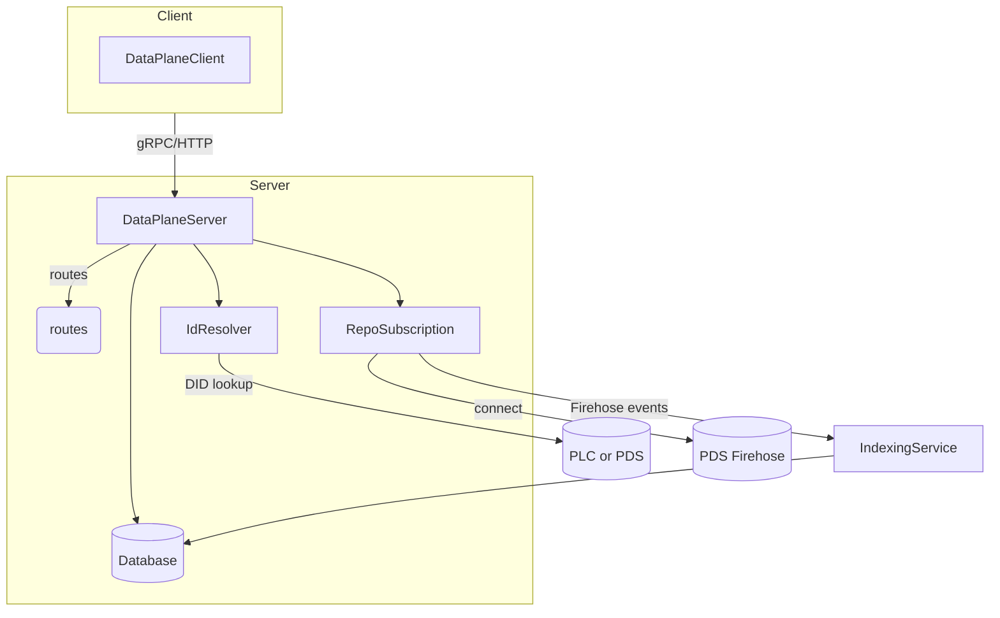

# Data Plane Overview

この文書では `packages/bsky/src/data-plane` ディレクトリの役割および構成について解説します。

## 目的

Data Plane は AppView が使用するデータ取得専用サービスを実装します。Repo の更新を購読し、各種クエリに応答できるようデータベースへインデックスを作成します。

## ディレクトリ構成

- **server/** – gRPC/HTTP サーバ実装。
  - **routes/** – プロトコル定義に基づく各種エンドポイント。
  - **db/** – Kysely を用いた DB アクセス層とマイグレーション。
  - **indexing/** – Firehose からのイベントを処理し、インデックスを更新するサービス。
  - **subscription.ts** – PDS Firehose へ接続し `IndexingService` へイベントを流す。
  - **background.ts** – 非同期タスク処理キュー。
- **client/** – Data Plane への接続クライアント。複数ホストを扱う `HostList` などを提供。
- **bsync/** – テスト用の簡易 Bsync サービス。
- **index.ts** – 上記モジュールをまとめて公開。

## 依存関係

- `@connectrpc/connect` 系ライブラリによる gRPC/HTTP 通信
- `express` を用いた HTTP サーバ
- `@atproto` の各種共通ライブラリ（identity, repo, sync など）
- `kysely` + `pg` による Postgres アクセス

## 主な処理フロー

- **DataPlaneClient** は複数ホスト構成に対応し、自動リトライを行います。
- **DataPlaneServer** は gRPC 経由でクエリや更新を受け付け、DB を参照します。
- **RepoSubscription** が Firehose からのイベントを受信し、`IndexingService` がレコード単位で DB へ反映します。

## 参考ソース

- サーバ生成: [`server/index.ts`](src/data-plane/server/index.ts)
- クライアント生成: [`client/index.ts`](src/data-plane/client/index.ts)
- インデックス処理: [`server/indexing/index.ts`](src/data-plane/server/indexing/index.ts)
- Bsync モック: [`bsync/index.ts`](src/data-plane/bsync/index.ts)
